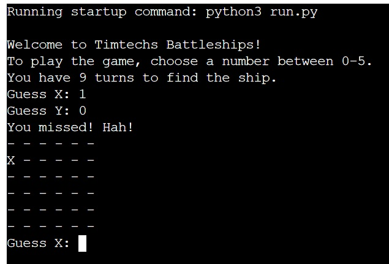
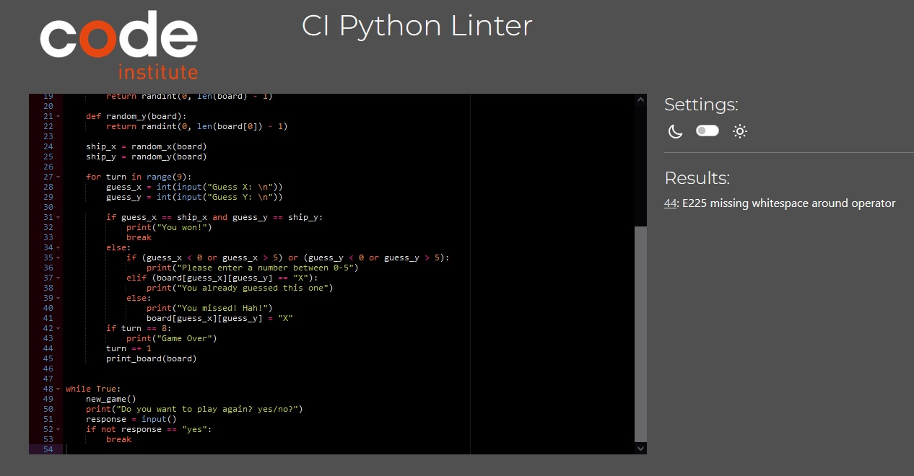

# Timtechs Battleship

Timtechs battleship is a battleship game where you try to find the computers ship before your turns run out.
The battlship takes up one space on the board

Link to live version of the [project](https://timtechs-battleship.herokuapp.com/)

## How to play

Timtechs Battleship is based on the original battlsehip game.
In this version, the player needs to sink the computers ship in the nine turns provided.

## Features

### Existing Features

- Board
    - Instructions to play the game is present
    - Also a message telling you that you only have nine moves to find the ship
    - Board is generated after you make your first guess

- Input validation
    - Tells you when your out of the gameboard
    - Tells when you already guessed that spot

- Endgame
    - Asks the player if they want to try again after they win or lose

### Future Features

- Adding a player board
- More ships to find
- Larger ships/board

## Data Model

I made a function to hosts most functions so that i could make a while loop to restart the game when the game ends.
Inside the functions i create a board which hosts the hidden boat that you need to find and also functions that give the player the abillity to guess.

## Testing

I tested this project manually by doing the following:

- Passed the code through [CI Python Linter](https://pep8ci.herokuapp.com/)
- With invalid inputs you get information that its not valid with strings
- tested on local terminal and Code Institute Herolu terminal

## Bugs

- Some bugs i was not able to get my head around so i remade the project in another way
- The game restarted no matter what i put into the prompt, its now fixed with better while loop

## Remaining Bugs

- A remaining bug that the validator also mentions in the picture below, is that it doesnt like me using =+. Im letting this bug stay here in the project because i couldnt make it work without it

## Validator Testing

- CI Python Linter
    - 44: E225 missing whitespace around operator, as mentioned before, i let this be so the code works

## Deployment

This project was deployed using Code Institute's mock terminal for Heroku

- Steps for deployment
    - Link project to heroku
    - Add config var PORT 8000
    - set buildpacks to python and nodejs
    - enabled automatic deployment
    - look at the build log

## Credits

- Code Institute for the deployment terminal
- [Copy assignment](https://copyassignment.com/battleship-game-code-in-python/) for ideas
- My sister @leyla jansson on slack, chat and talk about the code
- [Trinket.io](https://trinket.io/python/051179b6d3) for ideas and code thats been repurposed
